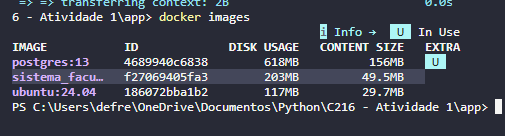
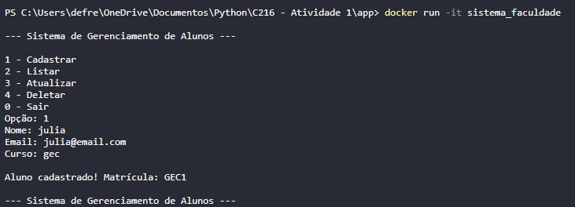
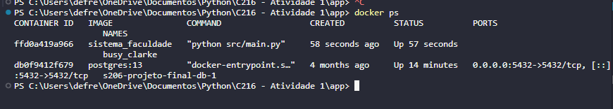

# Sistema de Gerenciamento de Alunos (CRUD em Python)

## Descrição
Este projeto consiste em um sistema simples de gerenciamento de alunos desenvolvido em Python, executado via terminal.  
O sistema implementa as operações básicas de um CRUD (**Create, Read, Update, Delete**) permitindo o controle de alunos de uma faculdade.

Cada aluno possui:
- Nome
- Email
- Curso
- Matrícula (gerada automaticamente)

A matrícula é formada pela sigla do curso seguida de um número sequencial.  
Exemplo: `GES1`, `GES2`, `GEC1`.

---

## Funcionalidades

- Cadastro de alunos  
- Listagem de alunos  
- Busca por matrícula  
- Atualização de dados  
- Remoção de alunos  
- Geração automática de matrícula  

---
## Como Executar o Projeto

### 1. Clone o repositório
```python
https://github.com/JuhDeFreitas/C216-L1.git
```

### 2. Execute o programa
````python
python main.py
````

# Docker

## 1) Criação do DockerFile
## 2) Geração da imagem Docker

  ``` docker build -t sistema_faculdade .t```

  

## 3) Rodando Programa dentro da Imagem docker

``` docker run -it sistema_faculdade ```



## 4) Container Docker


